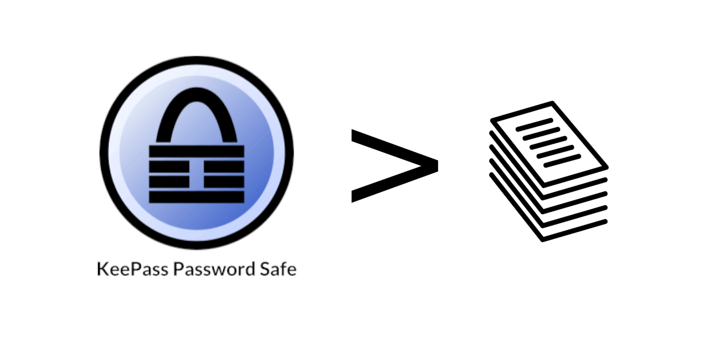

# keepass-print

Print password list from a keepass database for long-term backup.



> ⚠️ **WARNING**: Please exercise caution when using this tool! It takes you beyond encrypted realms, making your passwords readable by multiple npm libraries and tools like browsers. Additionally, the resulting output documents may leave traces on your computer, such as in your trash bin or even in your printer's cache. Be aware of these potential risks!

## Setup

To use `keepass-print` as a cli tool install it globally:

```
npm install -g keepass-print
```

## Usage

### command-line-interface (CLI)

If no password and no key-file is provided the tools ask to enter a password.

```
$> keepass-print --help
Usage: keepass-print [options] <database> <output>

Print password list from a keepass database for long-term backup.

Arguments:
  database                 path to the kdbx database file
  output                   path to the output file

Options:
  -V, --version            output the version number
  --outFormat [outFormat]  supported output formats (["json", "markdown", "html"]) (default: "json")
  --password [password]    password to access the database
  --key [keyFile]          path to the key-file to access the database
  --verbose                verbose output (default: false)
  -h, --help               display help for command
```

#### Examples

Basic usage (export json):
```
$> keepass-print ./database.kdbx ./database.json
```

Provide the password as parameter:
```
$> keepass-print --password "pass123" ./database.kdbx ./database.json
```

Provide a key-file instead of a password:
```
$> keepass-print --key ./secret/key ./database.kdbx ./database.json
```

Export as Markdown:
```
$> keepass-print --outFormat markdown ./database.kdbx ./database.md
```

Export as Html:
```
$> keepass-print --outFormat html ./database.kdbx ./database.html
```

## Dependencies

This tool makes heavy usage of the following libraries:
- [kdbxweb](https://www.npmjs.com/package/kdbxweb)
- [ejs](https://www.npmjs.com/package/ejs)

## Legal

- Copyright 2024 by [Alexander Wunschik](https://github.com/mojoaxel), all rights reserved.
- Licensed under a [AGPL-3.0](LICENSE) license.

